<!--
theme: gaia
size: 16:9
_class: lead
paginate: true
marp: false
backgroundColor: #000
backgroundImage: url('assets/hero-backgroundIES.jpg')
-->
<style>
section::after {
  content: attr(data-marpit-pagination) '/' attr(data-marpit-pagination-total);}
img[alt~="center"] {
  display: block;
  margin: 0 auto;
}
table {
  margin-left: auto;
  margin-right: auto;
}
footer {
  font-size: 20px;
 }
header {
  font-size: 16px;
 }
</style>
<style scoped>
section {
  @extend .markdown-body;
  font-size: 28px;
  justify-content: top;
 }
</style>

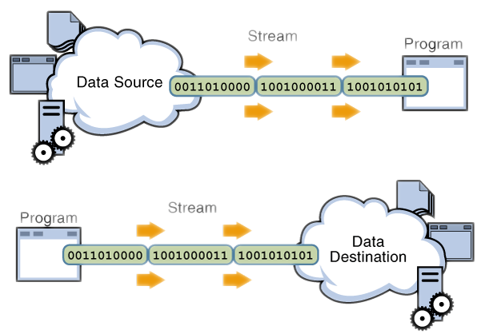
# **WebSockets de Java en la nube (AWS)**
#### II Jornades d'intercanvi d'experiències en FPCloud
###### version: 2023-08-05
___
<!-- footer: d.martinezpena@edu.gva.es -->
<!-- header: WebSockets de Java en la nube (AWS) - II Jornades d'intercanvi d'experiències en FPCloud-->
# ¿Qué veremos?
1. Introducción
2. Requisitos
3. Paso a paso
   3.1 Entorno en la nube
   3.2 Cliente local
   3.3 Ejecución de prueba
4. Fuentes de información

___
# 1. Introducción
La intención de este documento es la de dar una perspectiva más realista del uso de sockets, ya que en lugar de usar la misma máquina del alumno como cliente y servidor, vamos a desplegar el servidor del socket en una máquina alojada en la nube de Amazon (AWS).
___
# 2. Requisitos
Para realizar esta práctica guiada necesitamos:
- Acceso al Learner Lab proporcionado por el profesor. (https://awsacademy.instructure.com)
- Conocimientos sobre los websockets, IP's y puertos.
- Un dispositivo local con capacidad de ejecutar un cliente de socket, con acceso a los puertos e Ip's de AWS (*Ojo con la red de conselleria*)
___
# 3. Paso a paso
* Preparar el entorno de la nube (Cloud 9 sobre EC2)
* Entorno cliente (IntelliJ)
* Ejecución de prueba
___
## Iniciar laboratorio
Inicialmente el laboratorio está en rojo:

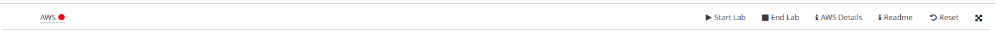

Elegimos la opción `Start Lab` y esperamos a que aparezca el laboratorio en verde:


___
<style scoped>
section {
  @extend .markdown-body;
  font-size: 20px;
  justify-content: top;
 }
</style>
Una vez aparece en verde podemos hacer click sobre las letras AWS y aparecerá el Dashboard de AWS (debemos permitir las ventanas emergentes):

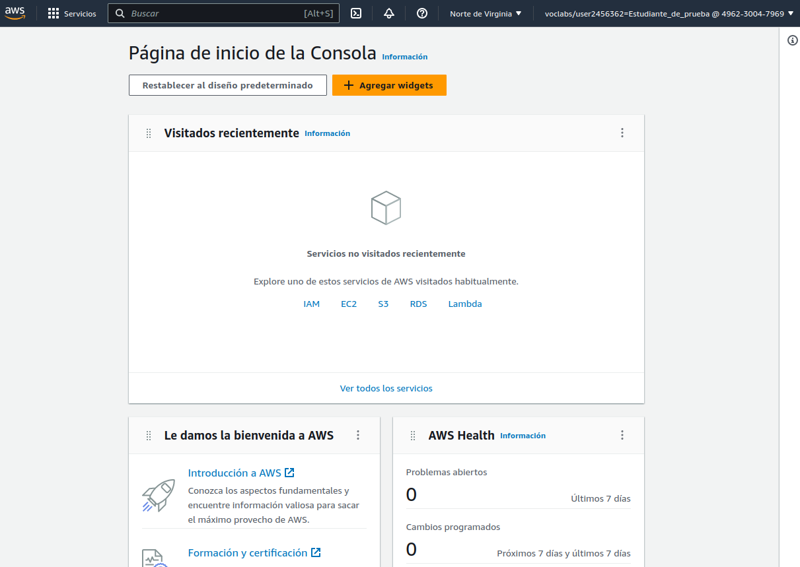
___
<style scoped>
section {
  @extend .markdown-body;
  font-size: 20px;
  justify-content: top;
 }
</style>
Buscamos Cloud9 en la parte superior del Dashboard:
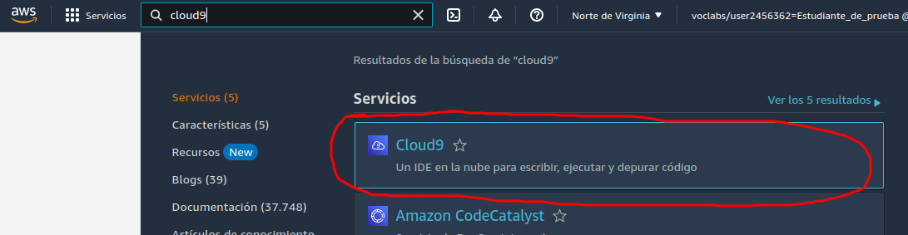
A continuación seleccionamos `Create environment`:
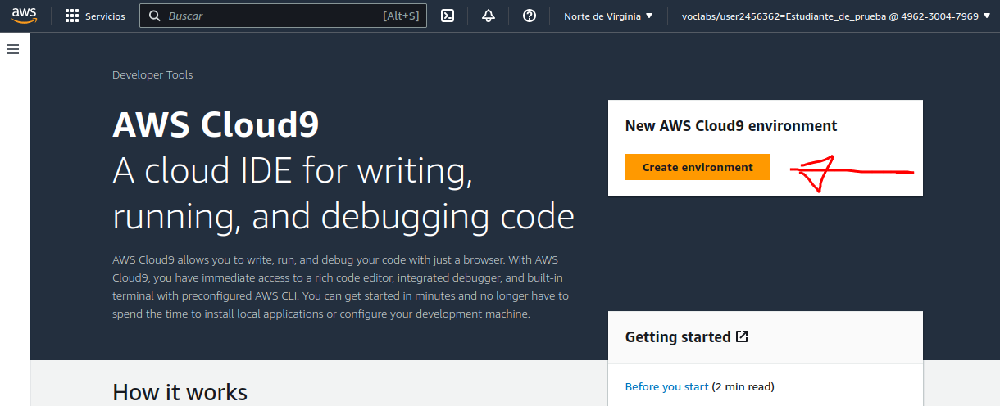
___
<style scoped>
section {
  @extend .markdown-body;
  font-size: 24px;
  justify-content: top;
 }
 </style>
 En la siguiente ventana debemos especificar:
  * **nombre** (`Name`)
  * cambiaremos la **plataforma** a `Ubuntu Server 22.04 LTS`
  * ampliar el tiempo de Timeout a `4 horas` i por último 
  * dentro de los **Network settings** conexión por `SSH`
  * resto de opciones por defecto y 
  * pulsar el botón naranja del final `Create`.

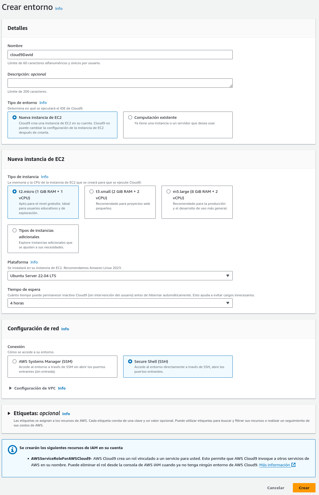
___
<style scoped>
section {
  @extend .markdown-body;
  font-size: 20px;
  justify-content: top;
 }
 </style>
 Si todo ha ido bien podemos seleccionar el botón `Open`:

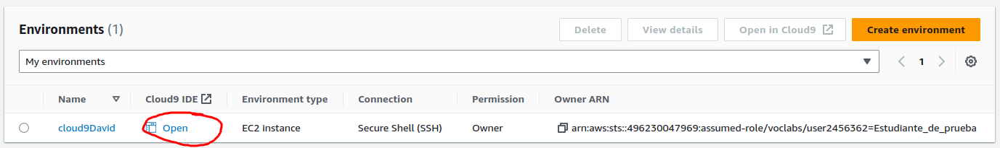
___
<style scoped>
section {
  @extend .markdown-body;
  font-size: 20px;
  justify-content: top;
 }
 </style>
 Y deberíamos ver algo parecido a esto:
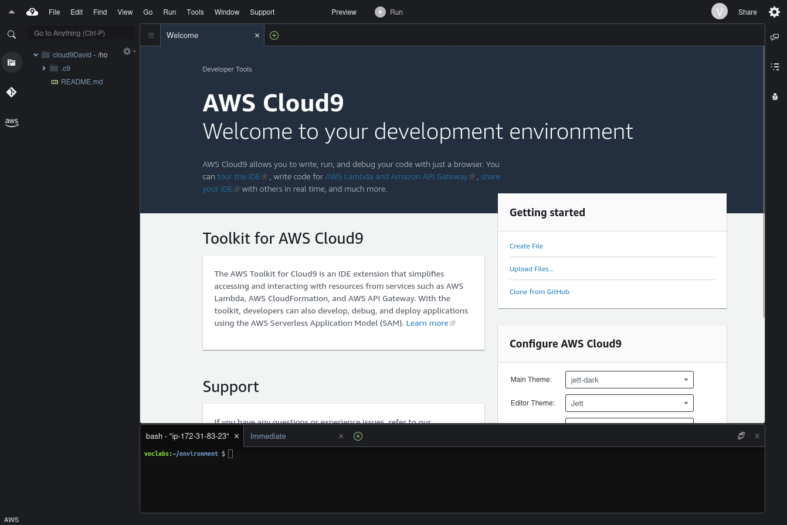
___
<style scoped>
section {
  @extend .markdown-body;
  font-size: 17px;
  justify-content: top;
 }
 </style>
Cerraremos la ventana de bienvenida, creamos `AWSServerSocket.java` con el código:
```java
import java.io.*;
import java.net.*;

public class AWSServerSocket {
    
    private static final int PORT=11000;

    public static void main(String[] args) throws IOException, ClassNotFoundException {
        String FraseClient;
        String FraseMajuscules;
        ServerSocket serverSocket;
        Socket clientSocket;
        ObjectInputStream entrada;
        ObjectOutputStream eixida;
        serverSocket = new ServerSocket(PORT);
        System.out.println("Server iniciado y escuchando en el puerto "+ PORT);
        while (true) {
            clientSocket = serverSocket.accept();
            entrada = new ObjectInputStream(clientSocket.getInputStream());
            FraseClient = (String) entrada.readObject();

            System.out.println("La frase recibida es: " + FraseClient);

            eixida = new ObjectOutputStream(clientSocket.getOutputStream());
            FraseMajuscules = FraseClient.toUpperCase();
            System.out.println("El server devuelve la frase: " + FraseMajuscules);
            eixida.writeObject(FraseMajuscules);

            clientSocket.close();
            System.out.println("Server esperando una nueva conexión...");
        }
    }
}
```
___
<style scoped>
section {
  @extend .markdown-body;
  font-size: 20px;
  justify-content: top;
 }
 </style>
 Debería quedar algo así:
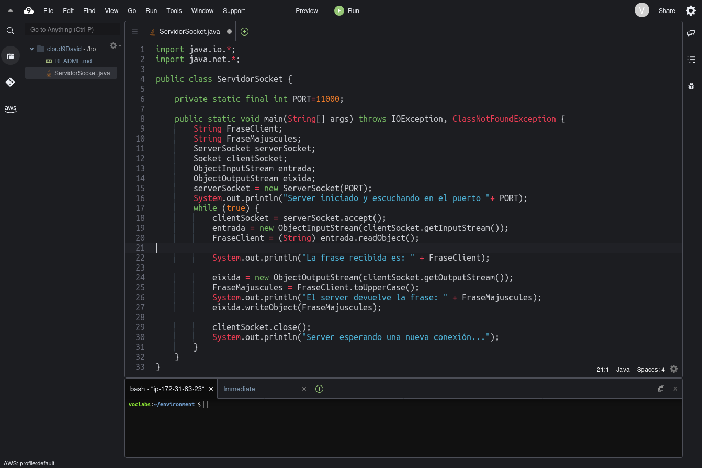
___
<style scoped>
section {
  @extend .markdown-body;
  font-size: 28px;
  justify-content: top;
 }
</style>
Y si iniciamos el servidor:

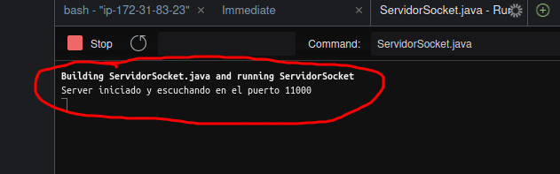
___
<style scoped>
section {
  @extend .markdown-body;
  font-size: 28px;
  justify-content: top;
 }
</style>
Buscar EC2:

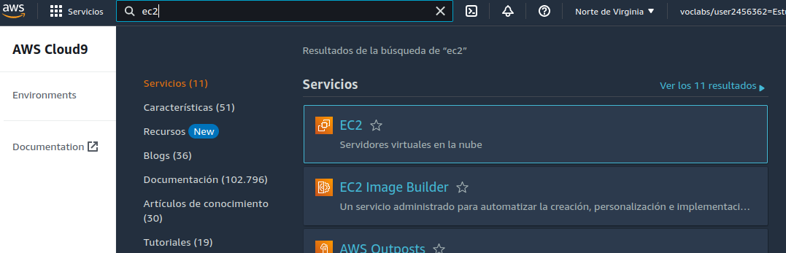
___
<style scoped>
section {
  @extend .markdown-body;
  font-size: 26px;
  justify-content: top;
 }
</style>
Una vez abierto elegimos la opción `Instancias (en ejecución)`:

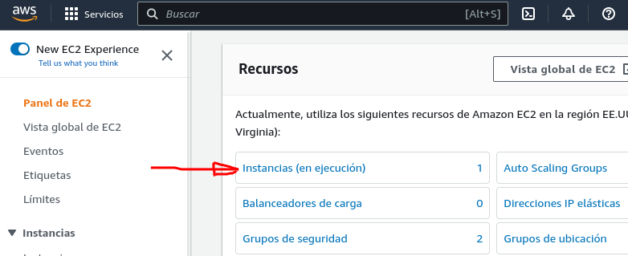
___
<style scoped>
section {
  @extend .markdown-body;
  font-size: 24px;
  justify-content: top;
 }
</style>
Contenga el nombre cloud9, marcar el check y a continuación elegir la pestaña `Seguridad`:

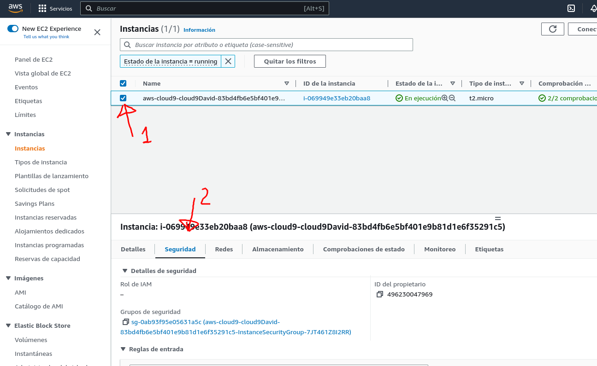
___
<style scoped>
section {
  @extend .markdown-body;
  font-size: 24px;
  justify-content: top;
 }
</style>
Solo tiene habilitada la entrada para el puerto 22 (SSH), hacemos click sobre el Grupo de seguridad:

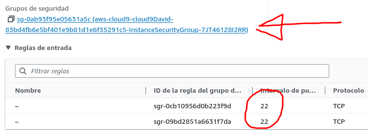
___
<style scoped>
section {
  @extend .markdown-body;
  font-size: 24px;
  justify-content: top;
 }
</style>
Añadiremos el puerto 11000 a las reglas de entrada, elegimos el botón `Editar reglas de entrada`, `Agregar regla` Elegimos `TCP Personalizado`, puerto 11000 y `AnywhereIpv4` y añadimos una descripción:

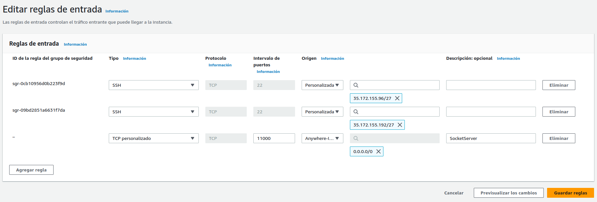

Una vez hecho esto si volvemos a la pestaña Seguridad de nuestra instancia EC2 veremos la regla añadida.
___
<style scoped>
section {
  @extend .markdown-body;
  font-size: 24px;
  justify-content: top;
 }
</style>
Necesitamos la DNS de IPv4 pública de nuestra instancia EC2: pestaña `Detalles`, parte derecha (copiar y guardar):

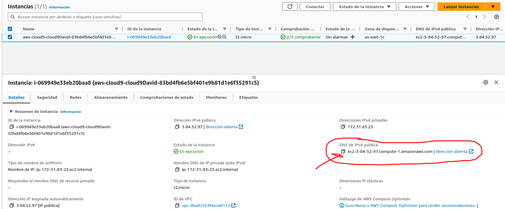
___
<style scoped>
section {
  @extend .markdown-body;
  font-size: 18px;
  justify-content: top;
 }
</style>
En nuestro IDE `AWSClienteSocket.java` con el siguiente código:

```java
import java.io.*;
import java.net.Socket;
import java.util.Scanner;

public class AWSClienteSocket {

    private final static int PUERTO = 11000;
    private static final String DNSAWS = "ec2-54-173-21-231.compute-1.amazonaws.com";
    //private static final String DNSAWS = "127.0.0.1";

    public static void main(String[] args) throws IOException, ClassNotFoundException {
        Scanner in = new Scanner(System.in);
        System.out.print("Introduce la frase a enviar en minúsculas: ");
        String frase = in.nextLine();

        try (Socket socket = new Socket(DNSAWS, PUERTO)) {
            ObjectOutputStream salida = new ObjectOutputStream(new BufferedOutputStream(socket.getOutputStream()));
            System.out.println("Se envia la frase: " + frase);
            salida.writeObject(frase);
            salida.flush(); //vaciamos el buffer

            ObjectInputStream entrada = new ObjectInputStream(new BufferedInputStream(socket.getInputStream()));
            System.out.println("La frase recibida es: " + (String) entrada.readObject());
        } catch (IOException ex) {
            System.err.println("Error. De entrada salida.");
        }
    }
}
```
> Recuerda cambiar la constante `DNSAWS`.
___
<style scoped>
section {
  @extend .markdown-body;
  font-size: 24px;
  justify-content: top;
 }
</style>
# Ejecución de prueba
 * ## Desde el punto de vista del cliente
 * ```sh
   Introduce la frase a enviar en minúsculas 
   ```
 * Escribimos nuestra frase, y al pular INTRO obtenemos el siguiente resultado:
 * ```sh
   Introduce la frase a enviar en minúsculas
   esta frase está en minúsculas
   Se envia la frase esta frase está en minúsculas
   La frase recibida es: ESTA FRASE ESTÁ EN MINÚSCULAS
   ```
___
<style scoped>
section {
  @extend .markdown-body;
  font-size: 24px;
  justify-content: top;
 }
</style>
# Ejecución de prueba
 * ## Desde el punto de vista del servidor
 * La consola de salida del servidor por su parte debe haber registrado la conexión del cliente, la recepción de la frase, y la frase devuelta:
 * ```sh
   Server iniciado y escuchando en el puerto 11000
   La frase recibida es: esta frase está en minúsculas
   El server devuelve la frase: ESTA FRASE ESTÁ EN MINÚSCULAS
   Server esperando una nueva conexión...
   ```
 
___
<!-- footer: "" -->
<style scoped>
section {
  @extend .markdown-body;
  font-size: 63px;
  display: flex;
  flex-direction: column;
  justify-content: center;
  text-align: center;
 }
</style>
# GRACIES!
 d.martinezpena@edu.gva.es

<!-- Put this script at the end of Markdown file. -->
<script type="module">
import mermaid from 'https://cdn.jsdelivr.net/npm/mermaid@10.0.0/dist/mermaid.esm.min.mjs';
mermaid.initialize({ startOnLoad: true });

window.addEventListener('vscode.markdown.updateContent', function() { mermaid.init() });
</script>